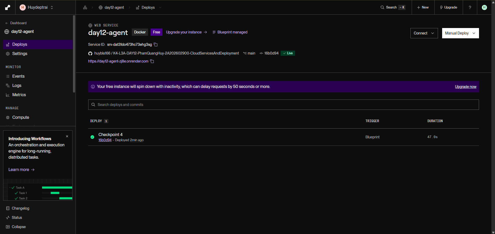
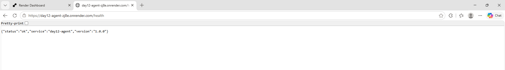

# Thông Tin Deploy — Checkpoint 5

> Điền file này sau khi deploy xong. `pytest tests/test_cp5.py` đọc file này
> để tìm địa chỉ service của bạn và gọi thử.
>
> **Chỉ ghi TÊN biến môi trường, tuyệt đối không dán giá trị API key vào đây.**
> Repo này công khai — dán khóa vào là mất khóa.

## Thông Tin Học Viên

| Mục | Nội dung |
|-----|----------|
| Họ và tên | Phạm Quang Huy |
| Mã học viên | 2A202602900 |
| Repo | https://github.com/huybla166/K4-L3A-DAY12-PhamQuangHuy-2A202602900-CloudServicesAndDeployment |

## Service

| Mục | Nội dung |
|-----|----------|
| Public URL | https://day12-agent-zj8e.onrender.com |
| Platform | Render (Blueprint từ `render.yaml`, web service Docker, gói Free) |
| Ngày deploy | 2026-09-28 |

## Biến Môi Trường Đã Set Trên Cloud

Ghi tên biến và **nguồn giá trị**, không ghi giá trị:

| Biến | Đã set | Ghi chú |
|------|--------|---------|
| `PORT` | ✅ | platform tự gán |
| `AGENT_API_KEY` | ✅ | đặt trong dashboard, không nằm trong repo |
| `REDIS_URL` | ✅ | Render Key Value `day12-redis`, nối tự động qua `fromService` trong `render.yaml` |
| `RATE_LIMIT_PER_MINUTE` | ✅ | 10 |
| `MONTHLY_BUDGET_USD` | ✅ | 10.0 |
| `LOG_LEVEL` | ✅ | INFO |

## Lệnh Kiểm Tra

Thay `<URL>` bằng Public URL ở trên:

```bash
# 1. Liveness — mong đợi 200 {"status":"ok"}
curl -i <URL>/health

# 2. Readiness — mong đợi 200 {"status":"ready"} (đã nối được Redis)
curl -i <URL>/ready

# 3. Không có API key — mong đợi 401
curl -i -X POST <URL>/ask \
  -H "Content-Type: application/json" \
  -d '{"question":"Hello"}'

# 4. Có API key — mong đợi 200 kèm câu trả lời
curl -i -X POST <URL>/ask \
  -H "Content-Type: application/json" \
  -H "X-API-Key: $AGENT_API_KEY" \
  -H "X-User-Id: sv-test" \
  -d '{"question":"Deploy là gì?"}'

# 5. Rate limit — gọi 15 lần, những lần cuối phải trả 429
for i in $(seq 1 15); do
  curl -s -o /dev/null -w "%{http_code} " -X POST <URL>/ask \
    -H "Content-Type: application/json" \
    -H "X-API-Key: $AGENT_API_KEY" \
    -H "X-User-Id: sv-test" \
    -d '{"question":"test"}'
done; echo
```

## Kết Quả Chạy Thật

Output chạy ngày 2026-09-28 với `<URL>` = https://day12-agent-zj8e.onrender.com
(chỉ giữ dòng status và body; API key không xuất hiện trong output):

```
$ curl -i <URL>/health
HTTP/1.1 200 OK
{"status":"ok","service":"day12-agent","version":"1.0.0"}

$ curl -i <URL>/ready
HTTP/1.1 200 OK
{"status":"ready","redis":true}

$ curl -i -X POST <URL>/ask  (không có API key)
HTTP/1.1 401 Unauthorized
{"detail":"invalid or missing API key"}

$ curl -i -X POST <URL>/ask  (X-API-Key: $AGENT_API_KEY, X-User-Id: sv-test)
HTTP/1.1 200 OK
{"answer":"Câu hỏi hay. Deploy là gì thường được giải quyết bằng cách chuẩn hóa môi trường chạy: cùng một image chạy giống nhau ở laptop và trên cloud.","user_id":"sv-test","history_length":0,"cost_usd":2.145e-05,"tokens":{"in":3,"out":35}}

$ rate limit — gọi 15 lần (X-User-Id: sv-test)
200 200 200 200 200 200 200 200 200 429 429 429 429 429 429
```

Rate limit chỉ cho 9 lần 200 vì lệnh 4 ngay trước đó (cùng `sv-test`, trong
cùng cửa sổ 60 giây) đã dùng 1 lượt — tổng cộng đúng 10 request/phút.

## Ảnh Chụp Màn Hình

Đặt ảnh trong thư mục `screenshots/`:

- `screenshots/dashboard.png` — trang quản lý service trên platform
- `screenshots/health.png` — kết quả gọi `/health` từ trình duyệt hoặc curl

**Dashboard Render** — service `day12-agent` trạng thái **Live**, deploy commit `16b0d94` (Checkpoint 4):



**`/health` trên Public URL** — trả `{"status":"ok","service":"day12-agent","version":"1.0.0"}`:


